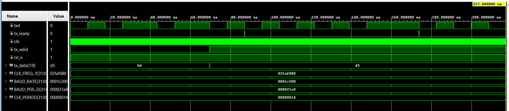
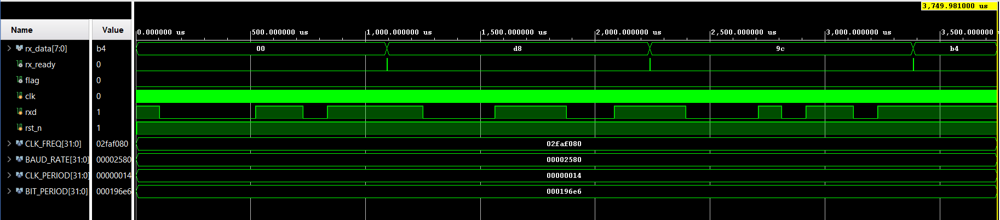

# UART Transmitter and Receiver RTL

Parameterized Verilog RTL cores for a UART Transmitter (TX) and Receiver (RX).


## 🚀 Key Features

* **Fully Parameterizable:** Both modules are easily configurable for any system clock frequency (`CLK_FREQ`/`CLK_FREQUENCY`) and target `BAUD_RATE`.
* **Robust RX Oversampling:** The receiver employs a 16x oversampling strategy with consistent mid-bit sampling (`MID_SAMPLE = 7`) for maximum timing margin and noise immunity.
* **Uniform TX Bit Timing:** The transmitter utilizes a synchronous FSM-based design tightly coupled with a baud counter to guarantee precise bit periods.
* **Standard Handshaking:** Built for easy integration featuring a simple `tx_valid`/`tx_ready` interface for the TX core, and a clean, single-cycle `rx_ready` pulse for the RX core.
* **Asynchronous Handling & Error Detection:** The RX module includes a 2-flop synchronizer (`rxd_sync`) to safely handle the asynchronous `rxd` input and a dedicated `flag` for frame errors.
* **Complete Verification:** Both modules are accompanied by flexible, task-based testbenches for thorough functional verification.


## 📂 Repository Structure

```text
uart_tx_rx_rtl/
├── rtl/
│   ├── uart_rx_rtl.v        # UART Receiver core
│   ├── uart_tx_rtl.v        # UART Transmitter core
│   └── uart_top.v           # Unified top-level wrapper
├── tb/
│   ├── uart_rx_rtl_tb.v     # Receiver unit testbench
│   └── uart_tx_rtl_tb.v     # Transmitter unit testbench
├── doc/
│   ├── rx_schematic.pdf     # RX RTL schematic
│   ├── tx_schematic.pdf     # TX RTL schematic
│   ├── rx_waveform.png      # RX simulation waveform
│   └── tx_waveform.png      # TX simulation waveform
└── README.md                # Project documentation

```


## ⚙️ Module Parameters

You can configure the sub-modules directly or through the top-level wrapper using the following parameters:

| Parameter | Default Value | Description |
| --- | --- | --- |
| `CLK_FREQ`/`CLK_FREQUENCY` | `50_000_000` | The frequency of the system clock (`clk`) in Hz. |
| `BAUD_RATE` | `115200` | The desired communication speed in bits per second. |


## 🔌 Port Descriptions

### Receiver (`uart_rx_rtl.v`)

| Port Name | Direction | Width | Description |
| --- | --- | --- | --- |
| `clk` | Input | 1 | System clock. |
| `rst_n` | Input | 1 | Active-low asynchronous reset. |
| `rxd` | Input | 1 | Serial data input line. |
| `rx_data` | Output | 8 | Parallel data byte received. |
| `rx_ready` | Output | 1 | Single-cycle pulse indicating `rx_data` is valid. |
| `flag` | Output | 1 | Frame error flag (asserts high on invalid start/stop bit). |

### Transmitter (`uart_tx_rtl.v`)

| Port Name | Direction | Width | Description |
| --- | --- | --- | --- |
| `clk` | Input | 1 | System clock. |
| `rst_n` | Input | 1 | Active-low asynchronous reset. |
| `tx_data` | Input | 8 | Parallel data byte to be transmitted. |
| `tx_valid` | Input | 1 | Triggers the transmission of `tx_data`. |
| `txd` | Output | 1 | Serial data output line. |
| `tx_ready` | Output | 1 | High indicates the TX module is ready for new data. |


## 🧪 Verification & Simulation

The repository includes dedicated unit testbenches for both modules (`uart_rx_rtl_tb.v` and `uart_tx_rtl_tb.v`). These testbenches instantiate the modules, calculate specific baud/clock periods, and inject data sequences to verify standard operation.

### Transmitter Simulation

Below is the simulation waveform demonstrating the transmission of parallel data into a serialized bitstream:



Schematic: [tx_schematic.pdf](doc/tx_schematic.pdf)

### Receiver Simulation

Below is the simulation waveform demonstrating the 16x oversampled reception and decoding of a serial bitstream back into parallel bytes:



Schematic: [rx_schematic.pdf](doc/rx_schematic.pdf)
